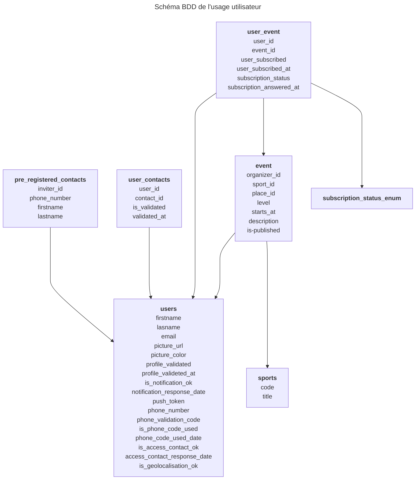

# Application mobile FEDER de BT SPORT

## Contexte

Cette application a pour objectif de répondre aux besoins des sportifs en offrant une flexibilité maximale pour pratiquer ensemble, près de chez eux, même à la dernière minute !
BT SPORT se veut être une plateforme centralisant toutes les ressources nécessaires pour faciliter la pratique et la progression sportive, tout en encourageant chaque utilisateur à devenir acteur d’une communauté qui profite aux sportifs de tous niveaux.
L’engagement BT SPORT est de permettre une pratique du sport facilitée pour tous, valide et en situation de handicap, tout en optimisant l’utilisation du matériel sportif déjà en service.

Elle doit offrir trois services; le partage, à travers la formation d'équipes parmis ses contacts; la progression, à travers une pratique facilitée; la location, à travers la mise en lien avec des pourvoyeurs de materiel.

## Structuration

Un onboarding avec création de compte, un parcours de création de profil, un parcours de création d'une équipe.
En fin de parcous initial, demande de validation de notifications.

une section avec les activités, avec une vue liste et une vue carte, avec une recherche par proximité, par adresse et filtre.
Avec une parcours de création d'activité avec tout d'abord une carte pour la séléction d'un lieu, un écrand d'édition d'activité.
Une affichage de mes activités propores (créées par moi ou auxquelles je me suis inscrit).
Un utilisateur peut s'inscrire à une activité.

### Spécificités applicatives

- notifications
- localisation d'évènements
- géolocalisation personnelle
- carte d'affichage d'évènements
- accès aux contacts du téléphone
- comptes "fantomes", avec numéros de téléphone des contacts que les utilisateurs ajoutent (tables spécifique avec ces phantomes et leur lien avec un inviter)

### Schémas BDD

### Structuration du routage

Liste des pages :

- onboarding (`onboarding`): slides d'intro, Login page avec bouttons création d'events, bouton de login qui ouvre une modale grande taille qui demande les identifiants (email mdp ou SSO).
- layout auth (`auth`) qui bloque un user sur le profile si profile_validated is not true
  - profile screen (`profileScreen`): 2 modes; création / vue
  - équipe screen initial (`squadScreen`): 2 modes: initial / edit
  - validation du téléphone (`phoneValidation`).
  - accès contact (`repertoryAccess`)
  - activités (`activities`)
    - liste: (`activitiesScreen`)
    - création & modification (`activitiesEdition/[id]`)
  - mes activités (`myActivities`)
    - liste: (`listScreen`)
    - détail: (`activitiesEdition/[id]`)
